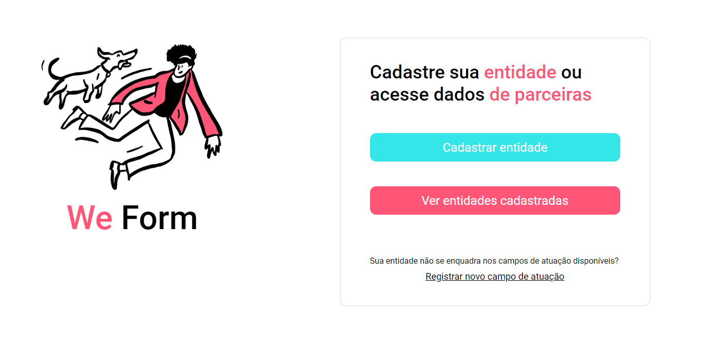
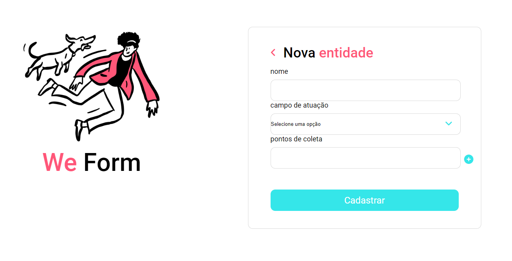

# We Form
## 🔹 Project description
Desenvolvimento de duas páginas web para o projeto We Form do curso Ada Tech + Santander Coders na trilha de front-end Angular. 

Consiste em uma página home e outra de cadastro de entidade, baseadas em um design feito no figma, que foram desenvolvidas para praticar os conceitos aprendidos durante o curso.

## Languages, Dependencies and Libs 📚
HTML, CSS, Figma.

## Developer
Maria Eduarda Cardoso de Souza, meduardacardoso.121@gmail.com.

## Previews

